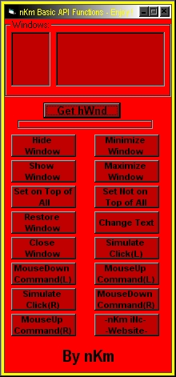



## Basic Windows API Functions\. A WHoLE BUNCH\!

### Description

The purpose of this is to educate people about the wounderful world off A.P.I.. This has over 100 API stuff. In the screenshot there is only like 10. But there are the codes for over 100 stuff in this baby!
 
### More Info
 
Umm...

Umm.... this maybe hard if your kind of stupid. Easy if you are allright. A waste of time if your an expert.

Whatever you want it to return...

NONE BABY! MY CODES ARE CLEAN! hehe

             |
---                |---
**Submitted On**   |2000-04-12 06:48:38
**By**             |[N/A](https://github.com/Planet-Source-Code/PSCIndex/blob/master/ByAuthor/empty.md)
**Level**          |Intermediate
**User Rating**    |4.3 (34 globes from 8 users)
**Compatibility**  |VB 5\.0, VB 6\.0
**Category**       |[Windows API Call/ Explanation](https://github.com/Planet-Source-Code/PSCIndex/blob/master/ByCategory/windows-api-call-explanation__1-39.md)
**World**          |[Visual Basic](https://github.com/Planet-Source-Code/PSCIndex/blob/master/ByWorld/visual-basic.md)
**Archive File**   |[CODE\_UPLOAD47174122000\.zip](https://github.com/Planet-Source-Code/basic-windows-api-functions-a-whole-bunch__1-7192/archive/master.zip)

